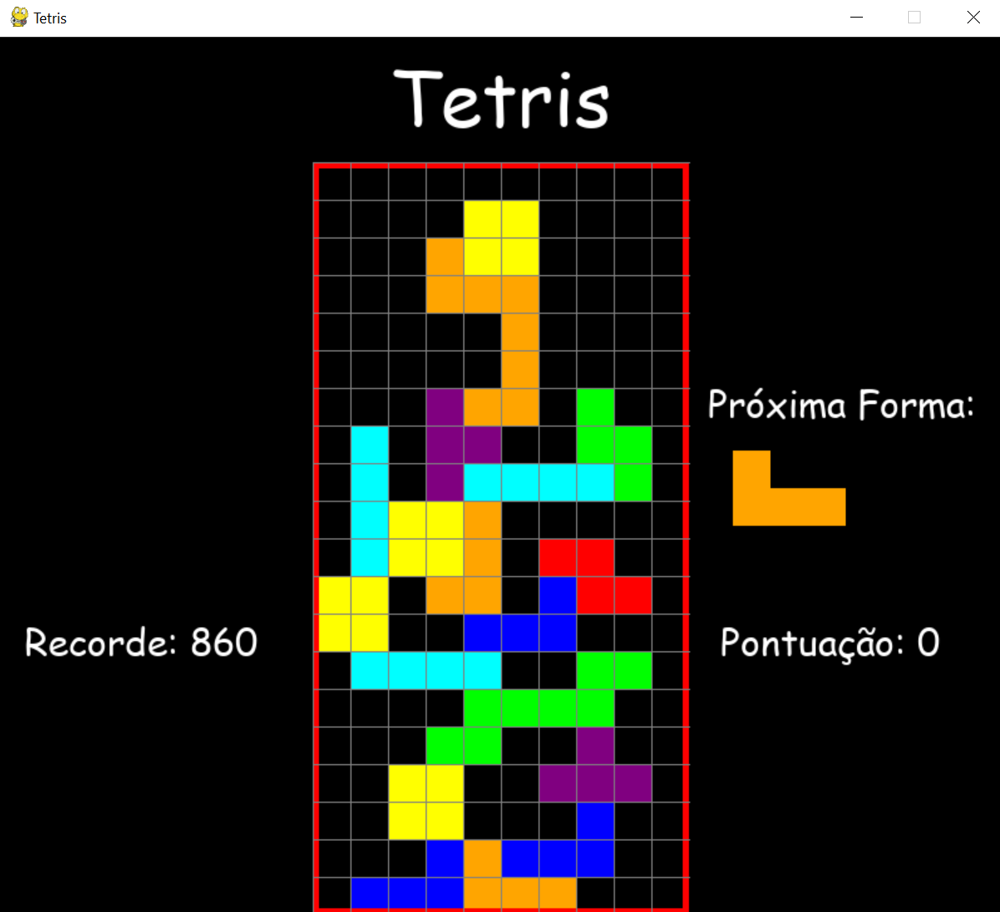

# tetris-python

# Descrição do projeto
Minha versão de Tetris, desenvolvido em Python.

Tetris é um jogo electrônico muito popular, desenvolvido por Alexey Pajitnov, Dmitry Pavlovsky e Vadim Gerasimov, e lançado em junho de 1984. Pajitnov e Pavlovsky eram engenheiros informáticos no Centro de Computadores da Academia Russa das Ciências e Vadim era um aluno com 16 anos.

Tetris foi um dos primeiros itens de exportação de sucesso da Rússia e um dos primeiros a ser visto como um tipo de vício. Atingiu um público alvo inédito na história dos videogames.

O jogo consiste em empilhar tetraminós que descem a tela de forma que completem linhas horizontais. Quando uma linha se forma, ela se desintegra, as camadas superiores descem, e o jogador ganha pontos. Quando a pilha de peças chega ao topo da tela, a partida se encerra.

Pajitnov percebeu o potencial do jogo por não conseguir parar de jogar antes mesmo de terminar o programa, bem como dois colegas de trabalho que ajudaram a finalizar o jogo e todos os colegas do centro de computação, que haviam recebido cópias em disquetes gravados pelo próprio Pajitnov.

Construído sobre regras simples, o Tetris se estabeleceu como um dos grandes videogames iniciais. Em dezembro de 2011, Tetris vendeu 202 milhões de cópias - aproximadamente 70 milhões de unidades físicas e 132 milhões de downloads pagos de jogos para celular - tornando-se uma das franquias de videogame mais vendidas de todos os tempos.

Tetris está disponível em mais de 65 plataformas, estabelecendo um recorde mundial do Guinness para o videogame mais adaptado. Tetris está enraizado na cultura popular e sua popularidade se estende além da esfera dos videogames; as imagens do jogo influenciaram a arquitetura, a música e o cosplay. O jogo também foi objeto de várias pesquisas que analisaram sua complexidade teórica e mostraram seu efeito no cérebro humano após uma sessão, em particular o efeito Tetris.

O site IGN colocou Tetris na sua lista de dez mais influentes jogos de todos os tempos.

Curiosidade: 
Em 2014, um grupo de psicólogos da universidade de Plymouth, nos Estados Unidos, defende que o desejo de consumir alimentos calóricos, bebidas alcoólicas e cigarros diminui ao jogar Tetris. Segundo os investigadores, a montagem das peças do Tetris e a rapidez do jogo faz com que os jogadores não tenham tempo para pensar em comer, o mesmo acontecendo com outros vícios, como o álcool e o tabaco.

Fonte: 
pt.wikipedia.org/wiki/Tetris
 

# Captura de tela

 
Será que consegue bater meu recorde? :sunglasses:

# Rodando o projeto
* git clone + a URL fornecida no botão "Code" acima.
 ou 
* Fazer o "Download ZIP" no botão "Code" acima.
